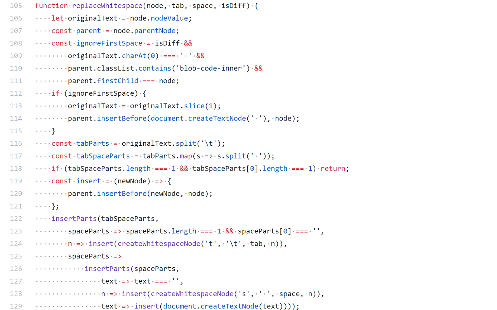

# Render Whitespace on GitHub - a browser extension

Are they tabs? Are they spaces? How many?
Never wonder again!

Copy-paste the file below into the console to see the whitespace like this:

## Installation

* Chrome WebStore: https://chrome.google.com/webstore/detail/ifdbipohclgnokjgpejhnbjdlgjkkhom
* Firefox Add-on: https://addons.mozilla.org/en-GB/firefox/addon/render-whitespace-on-github

Alternatively, you can install this as a userscript.

To install as a userscript in Chrome, save the JavaScript file and drag it onto the chrome://extensions page.

If you use ViolentMonkey, TamperMonkey, or GreaseMonkey, install from one of these links:

* https://openuserjs.org/scripts/glebm/Render_Whitespace_on_GitHub
* https://greasyfork.org/en/scripts/32986-render-whitespace-on-github
